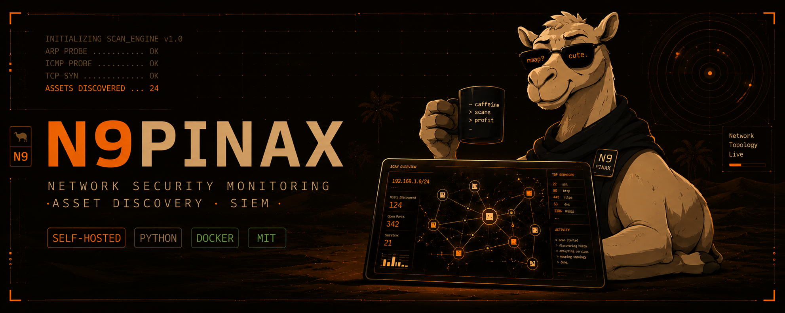
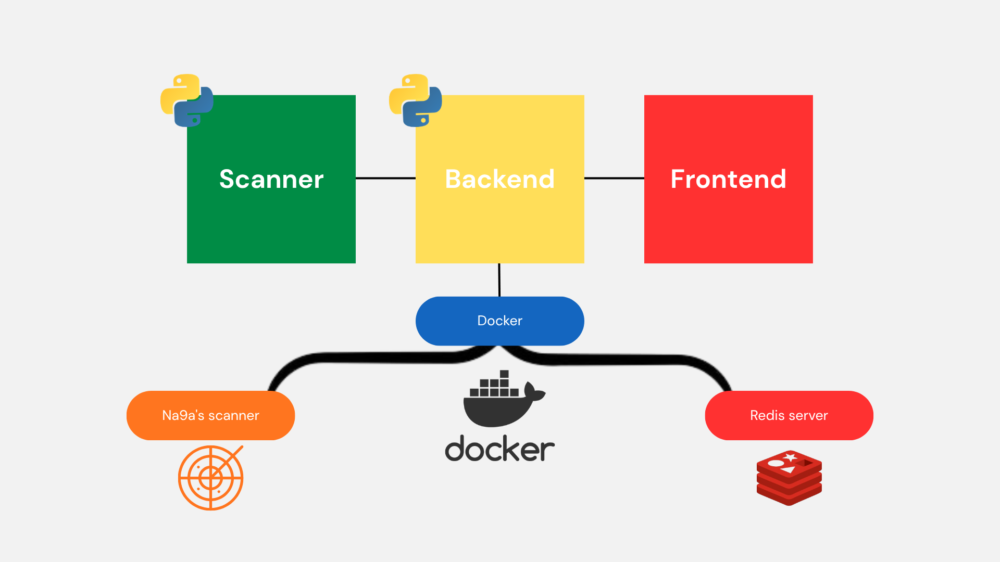

## *This project has been created as part of the ISTA curriculum a fucked up curriculum.* 

<!-- 9sem -->
<div style="display: flex; justify-content: space-between; align-items: center;">
  <span style="font-size: 45px;">📄</span>
  <span style="font-size: 40px;">🐪</span>
</div>

<p align="center">
  
</p>

<p align="center">
  
  
  
  
  
  
</p>

<p align="center">
  <em>A self-hosted network security monitoring and asset discovery platform built around SIEM principles.</em>
</p>

## 📑 Table of Contents

- [Description](#-description)
- [Tech Stack](#-tech-stack)
- [Features](#-features)
- [Prerequisites](#-prerequisites)
- [Installation](#-installation)
- [Configuration](#-configuration)
- [Architecture](#-architecture)
- [Demo](#-demo)

---

## Description

> N9pinax is a self-hosted network security monitoring and asset discovery platform built around SIEM principles. It automatically discovers devices on a local network using ARP, ICMP, TCP SYN, and UDP probes, then enriches collected data with vendor identification, operating system fingerprinting, device classification, and hostname resolution. The platform continuously analyzes the network environment, generates rule-based security alerts, and streams results in real time to an interactive web dashboard, providing comprehensive visibility into network assets and potential security risks.

---

## 🛠 Tech Stack

| Layer | Technology |
|---|---|
| Backend API | FastAPI + SSE (Server-Sent Events) |
| Scanner engine | Scapy (raw sockets) |
| Frontend | Vanilla JS + HTML |
| Cache | Redis |
| Storage | SQLite |
| Deployment | Docker + Docker Compose |

---

## ✨ Features

- **Automated Asset Discovery** — ARP, ICMP, TCP SYN, and UDP probes sweep the network automatically. No config needed beyond a target CIDR range.
- **Data Enrichment** — Every asset gets vendor ID via OUI lookup, OS fingerprinting via TCP/IP stack analysis, device classification, and hostname resolution.
- **Real-Time Analysis** — Continuous rule-based alert engine fires on anomalies, new devices, port exposures, and behavioral patterns — streamed live via SSE.
- **Interactive Web Dashboard** — Live UI for asset visualization, alert monitoring, and network activity. Built-in filtering, search, and device detail panels.
- **Reports & Export** — Generate and export scan reports directly from the dashboard.
- **Self-Hosted** — Your data never leaves your network. Full control, full customization. No cloud dependency.

---

## 🔧 Prerequisites
- Linux (or Windows WSL2) — raw packet scanning requires a Linux network stack
- Python 3.10+
- Docker 24+ and Docker Compose v2
- Root / sudo privileges for scanning operations

---

## 🐪 Installation

> [!WARNING]
> N9pinax performs active network scanning using raw packets. Only run it on networks you own or have explicit permission to scan. Unauthorized network scanning may be illegal in your jurisdiction.

1. Clone the repository:
```bash
git clone https://github.com/Dna9a/N9PINAX.git
```

2. Navigate to the project directory:
```bash
cd N9PINAX
```

3. Install dependencies and start the platform:
```bash
make start
```

4. Access the web dashboard at :
```shell
# open in web browser
http://localhost:8000
http://<your-server-ip>:8000
```

> **Note**: N9pinax requires root/administrator privileges to perform raw packet scanning (ARP, TCP SYN, ICMP probes).

---

## ⚙️ Configuration

All configuration is done via the `.env` file at the project root.

| Variable | Default | Description |
|---|---|---|
| `TARGET_NETWORK` | `192.168.1.0/24` | CIDR range to scan |
| `SCAN_INTERVAL` | `60` | Seconds between full discovery sweeps |
| `DASHBOARD_PORT` | `8000` | Port for the web dashboard |
| `ALERT_THRESHOLD` | `medium` | Minimum alert severity to report (`low`, `medium`, `high`) |
| `ENABLE_OS_FINGERPRINT` | `true` | Enable/disable OS fingerprinting via TCP/IP stack analysis |
| `ENABLE_VENDOR_LOOKUP` | `true` | Enable/disable MAC vendor OUI lookup |
| `LOG_LEVEL` | `info` | Logging verbosity (`debug`, `info`, `warn`, `error`) |
| `DATA_RETENTION_DAYS` | `30` | How many days to retain historical scan data |
| `WEBHOOK_URL` | _(empty)_ | Optional webhook endpoint for alert forwarding |

### Example `.env`

```env
TARGET_NETWORK=10.0.0.0/16
SCAN_INTERVAL=30
DASHBOARD_PORT=8000
ALERT_THRESHOLD=low
ENABLE_OS_FINGERPRINT=true
ENABLE_VENDOR_LOOKUP=true
LOG_LEVEL=info
DATA_RETENTION_DAYS=90
WEBHOOK_URL=https://hooks.example.com/alerts
```

---

## Architecture
N9pinax is built using a modular architecture that separates the core components responsible for asset discovery, enrichment, analysis, and visualization. The main components include:
- **Scanner**: Responsible for performing network scans using ARP, ICMP, TCP SYN, and UDP probes to discover devices on the local network.
- **Backend**: Handles data enrichment, analysis, and alert generation. It processes the raw scan data, enriches it with additional information, and applies rule-based logic to identify potential security issues.
- **frontend**: Provides the web dashboard for visualizing discovered assets and security alerts. It communicates with the backend via WebSockets to receive real-time updates and allows users to interact with the data.
- **Docker**: The entire platform is containerized using Docker, making it easy to deploy and manage in various environments without worrying about dependencies or compatibility issues.



```
n9pinax/
├── backend/                     # Backend FastAPI REST + SSE API 
│   ├── app.py                   # API routes, authentication, static UI serving
│   ├── scan_service.py          # Scan orchestration + SSE events 
│   ├── events.py                # In-memory event bus for inter-component communication
│   └── ...                      # serializers, schemas, rate limiting, Redis cache 
├── scanner/                     # scanning engine and packet handling (requires root privileges)
│   ├── core/                    # ARP / ICMP / SYN / UDP probes and packet handling
│   ├── fingerprint/             # vendor / OS / device fingerprinting 
│   ├── alerts.py                # SIEM rules and alert generation 
│   ├── report.py                # report/export generation 
│   ├── storage.py               # SQLite persistence 
│   └── ...                      # models, utilities 
├── Frontend 2/                  # static UI (note the two spaces) 
│   ├── pages/                   # HTML pages (scan, devices, alerts, reports, admin, notes) 
│   ├── js/                     # UI logic, API helpers, SSE handling 
│   ├── css/                    # layout styles 
│   └── styles/                 # theme and components styles
├── Docker/                     # deployment
│   ├── Dockerfile              # application image build
│   ├── docker-compose.yml      # service orchestration (API, Redis)
│   ├── .env                    # environment configuration template for Docker deployment
│   └── ...                      # deployment scripts....
```

---

## 🎬 Demo

> Screenshot or GIF of the dashboard goes here.
> Record with [Kooha](https://github.com/SeaDve/Kooha) (Linux) or [ShareX](https://getsharex.com/) (Windows), export as GIF, and drop in `assets/demo.gif`.

```markdown

```

---

## 🔒 Security Warning

> [!WARNING]
> N9pinax uses raw packet techniques (ARP spoofing detection, TCP SYN probes, ICMP sweeps) that may trigger IDS/IPS systems on your network. It is intended for use by network administrators on infrastructure they own or manage. **Do not run this tool on networks without explicit authorization.** The authors take no responsibility for misuse.

---

> [!WARNING]
> THIS README IS STILL UNDERCONSTRUCTION 
> 


<!-- <p align="center">
  <em>Made with <a href="https://your-link.com">Dbvonie</a> as part of the PFE for the fucked up ISTA curriculum</em>
</p> -->

<p align="center">
  <em>Made with <a href="https://github.com/Dbvonie"><span style="color:#ff69b4;">Dbvonie</span></a> as part of the PFE for the fucked up ISTA curriculum</em>
</p>

